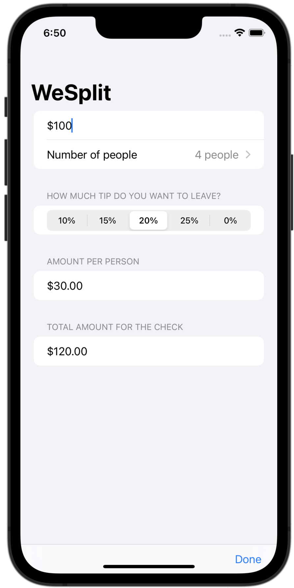

# WeSplit
A check-splitting app to be used after eating in a restaurant.

You enter the cost of your food, select how much of a tip you want to leave, and how many people you are with. 
And it will calculate for you how much each person needs to pay. 

Based on 100 Days with SwiftUI by Paul Hudson

